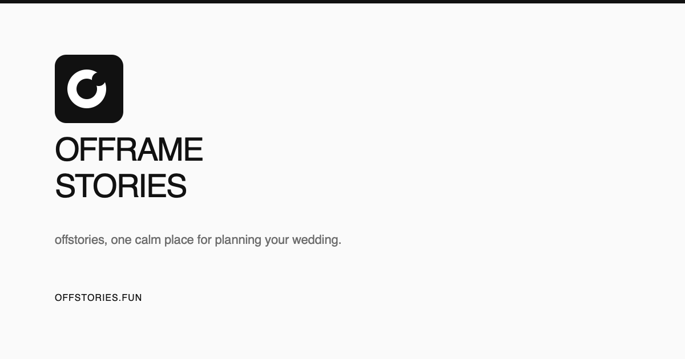

# OffStories

OffStories is a calm, shared workspace for planning a wedding together. It brings the timeline, checklist, budget, vendors, guests, notes, documents, and partner collaboration into one focused dashboard.

Live app: [offstories.fun](https://offstories.fun)



## What it includes

- Guided onboarding with blank and smart wedding setup options
- Personalized planning timeline and milestone tracking
- Wedding checklist with priorities and due dates
- Budget planning with paid, committed, and remaining amounts
- Vendor organization and status tracking
- Guest list and RSVP planning
- Notes and document references
- Workspace invitations for planning with a partner
- Responsive desktop and mobile navigation
- Safari-safe browser storage fallback for restricted browsing environments

## Tech stack

- React 19
- TanStack Start and TanStack Router
- TypeScript
- Vite 8
- Tailwind CSS 4
- Cloudflare D1 and R2
- Phosphor Icons
- Cloudflare Pages + Workers deployment

## Getting started

### Requirements

- Node.js 20 or newer
- npm 10+ or Bun
- A Cloudflare account with Pages, D1, and R2 enabled

### Install

```bash
git clone https://github.com/ammarhisyamm/off-stories.git
cd off-stories
npm install
```

### Configure environment variables

Create `.dev.vars` for local Cloudflare Pages development:

```bash
# Optional: used for email-related functionality
RESEND_API_KEY=your-resend-api-key
```

Never commit `.env`, `.env.local`, service-role keys, or other secrets. The repository ignores environment files by default.

### Run locally

```bash
npm run dev
```

The development server is available at `http://localhost:3000` unless Vite selects another port.

## Available scripts

| Command | Description |
| --- | --- |
| `npm run dev` | Start the local development server |
| `npm run build` | Create a production build |
| `npm run build:dev` | Create a development-mode build |
| `npm run preview` | Preview the production build locally |
| `npm run lint` | Run ESLint |
| `npm run format` | Format the project with Prettier |

## Project structure

```text
src/
├── components/             Shared UI and dashboard components
├── hooks/                  Browser and interaction hooks
├── integrations/cloudflare/ Cloudflare auth middleware and bindings
├── lib/                    Data functions, stores, helpers, and mock data
├── routes/                 TanStack file-based routes
├── start.ts                TanStack Start middleware setup
└── styles.css              Global tokens and application styles

cloudflare/
└── migrations/             D1 database schema migrations
```

## Application routes

| Route | Purpose |
| --- | --- |
| `/` | Public landing page |
| `/auth` | Sign up and sign in |
| `/dashboard` | Planning overview and onboarding |
| `/timeline` | Wedding milestones and dates |
| `/checklist` | Planning tasks |
| `/budget` | Expenses and budget tracking |
| `/vendors` | Vendor shortlist and booking status |
| `/guests` | Guest list and RSVP planning |
| `/notes` | Shared planning notes |
| `/documents` | Contracts and document references |
| `/settings` | Workspace and partner settings |

## Data and authentication

Cloudflare D1 handles authentication, workspace persistence, invitations, RSVP links, and planning data. Cloudflare R2 stores uploaded PDF/DOCX documents. Authenticated server functions resolve the active workspace and read or write the `workspace_data` records for each planning category.

Database migrations live in `cloudflare/migrations/`. Apply them with `npx wrangler d1 migrations apply off-stories --remote` before using authenticated workspace features in a fresh environment.

## Deployment

The app is configured for Cloudflare Pages in `vite.config.ts` (Nitro `cloudflare-pages` preset). The build emits static assets to `dist/` plus a single `dist/_worker.js` Pages Function that runs the TanStack Start server on Cloudflare Workers.

### Cloudflare Pages (dashboard / Git integration)

1. In the Cloudflare dashboard, create a new Pages project linked to this repo (or use Direct Upload).
2. Set the build command to `npm run build` and build output directory to `dist`.
3. Add the D1 binding `DB` and R2 bucket binding `DOCUMENTS` in Settings > Bindings. Use the database `off-stories` and bucket `off-stories-documents`.
4. Add `RESEND_API_KEY` only if email invites are enabled.
5. Deploy the `main` branch. Every push can trigger a new deployment when Git integration is enabled.

### Wrangler CLI (alternative)

```bash
npm run build
npx wrangler pages deploy dist --project-name off-stories
```

Environment variables (including `RESEND_API_KEY`) must be set for the Pages project — either in the dashboard or as a local `.dev.vars` file (gitignored) for `wrangler pages dev`.

## Contributing

1. Create a feature branch.
2. Make focused changes that preserve the existing visual language and accessibility.
3. Run `npm run lint` and `npm run build` before opening a pull request.
4. Describe user-facing changes and any database migration requirements.

## License

This project is currently maintained as a private product repository. Add the project license here when the repository is ready for public contributions.
